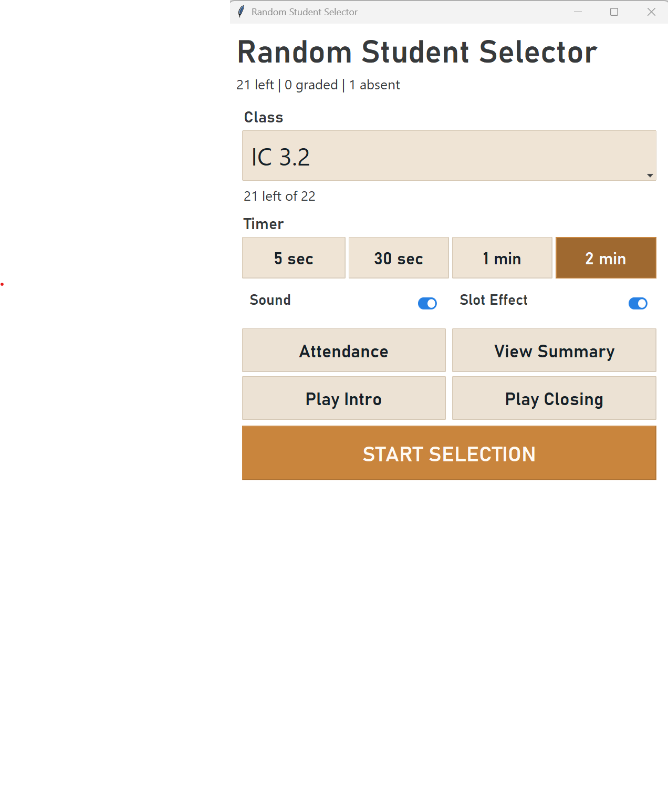

# Random Student Selector

`Random Student Selector` is a classroom desktop app for running attendance, randomly selecting students, recording quick outcomes, and keeping a lightweight session summary for each class.

The software was developed by Samuel Oehler-Huang at Suzhou Foreign Language School to enhance student engagement through structured, equitable participation. Its classroom design is informed by Active Learning theory: students are asked to think, prepare, respond, and receive feedback during the lesson rather than remaining passive listeners.

It is built with Tkinter + `ttkbootstrap` and is currently optimized for Windows classroom use, including high-DPI displays and multi-monitor setups.

## Screenshot



## Pedagogical rationale

This app is designed for teachers who want a practical structure for equitable classroom participation and a stronger culture of active student engagement.

Active Learning emphasizes the role of the learner as an active participant in the lesson. In this context, the app supports that goal by making participation expected, distributed, visible, and followed by immediate feedback. It does not replace teacher judgment or classroom relationships; it gives the teacher a lightweight structure for turning participation into a regular learning routine.

- Random selection reduces the tendency to rely on the same volunteers and helps spread participation across the full class.
- A visible countdown creates productive wait time: students know a response is coming, so they have a reason to think, rehearse, and stay engaged.
- Attendance and selection are linked, which keeps the active roster accurate and avoids repeatedly calling absent students.
- Quick outcome buttons make it easy to capture low-stakes formative information in the moment without turning participation into heavy data entry.
- The summary view gives the teacher a lightweight record of who contributed, who was absent, and who may need follow-up support.

In practice, the app is meant to support cold calling in a fairer and more sustainable way: high enough structure to improve participation, but light enough to use during a live lesson. The goal is not randomization for its own sake. The goal is to normalize active retrieval, explanation, accountability, and reflection across the whole class.

The design aligns with several practical Active Learning principles:

- **Equitable participation:** every present student remains part of the learning loop, not only the quickest volunteers.
- **Retrieval and explanation:** students are prompted to recall, organize, and express understanding aloud.
- **Productive wait time:** the countdown gives students a visible preparation window before responding.
- **Low-stakes formative assessment:** quick outcomes help the teacher notice patterns without interrupting lesson pace.
- **Responsive teaching:** the session summary gives the teacher evidence for follow-up, reteaching, or encouragement.

## Development context

Random Student Selector was developed by Samuel Oehler-Huang at Suzhou Foreign Language School. It was created for practical classroom use, with a particular focus on increasing student engagement and supporting Active Learning routines in live lessons.

## Current functionality

- Select a class from a roster loaded from `assets/students.csv`.
- Choose a built-in timer preset: `5 sec`, `30 sec`, `1 min`, or `2 min`.
- Run a slot-style student selection window with an optional animated reel effect.
- Toggle `Sound` and `Slot Effect` from the main dock.
- Play optional intro and closing audio cues from the main screen.
- Take attendance before or during a session.
- Mark each selected student as `A*`, `A`, `B`, `C`, `No Grade`, or `Absent`.
- Remove absent students from the active class roster for the current session.
- Keep chosen and absent students excluded while the app remains open.
- Show a session summary with counts and per-student outcomes.
- Resume an active session from the summary window.

## Typical classroom flow

1. Start the app.
2. Select a class.
3. Optionally click `Attendance` to run roll call.
4. Choose a timer preset.
5. Click `START SELECTION`.
6. When the selected student appears, choose one outcome:
   - `A*`, `A`, `B`, `C`
   - `No Grade`
   - `Absent`
7. Read the feedback popup, then either continue with `Next Student` or return to the main dock.
8. Open `View Summary` at any time to review the live session state.

## Attendance mode

The current app includes a sequential roll-call mode.

- Attendance prefers a secondary monitor when one is available.
- The roll-call window opens full screen by default.
- Keyboard shortcuts:
  - `Enter`, `Space`, `P`, `Right Arrow`: mark present
  - `A`, `Backspace`, `Left Arrow`: mark absent
  - `F11`: toggle full screen
  - `Esc`: exit full screen, then close
- When roll call finishes, the app shows a copyable absent list.
- Absent students are removed from the day's active session roster.

## Session outcomes

Each selected student can be recorded as one of these outcomes:

- `A*`
- `A`
- `B`
- `C`
- `No Grade`
- `Absent`

After a graded outcome, the app shows a feedback message chosen from `assets/messages.csv`.

The summary window tracks:

- remaining students
- graded students
- no-grade students
- absent students
- counts by grade band

## Required data files

The app expects these CSV files in `assets/`:

### `assets/students.csv`

Required. This file is intentionally ignored by Git so each user can keep a local class list.

Format:

```csv
class,student
IC 1.1,Anna Chen
IC 1.1,Ben Carter
IC 1.2,Jordan Lee
```

Notes:

- Two columns are required: class name, student name.
- A header row is allowed and will be skipped automatically.
- Duplicate student names within the same class are de-duplicated while preserving order.

### `assets/messages.csv`

Required. This file supplies the feedback popup text after grading.

Format:

```csv
Rating,Message
A*,"Outstanding contribution today."
A,"Strong answer. Keep pushing."
B,"Good effort. Tighten the detail."
C,"Have another go and build the idea."
```

Notes:

- The file uses `Rating` and `Message` columns.
- Multiple messages per rating are supported.
- Messages are chosen at random from the matching rating bucket.

## Audio behavior

Audio is optional.

- If `pygame` is available and the asset files exist, the app can play:
  - intro music
  - closing music
  - slot-loop audio
  - time-up sound
  - rating sounds
- If audio fails to initialize or files are missing, the app continues running without crashing.

## Running locally

Install the Python dependencies first:

```powershell
pip install ttkbootstrap pygame
```

Then run:

```powershell
python studentselector.py
```

## Build an executable

The repo includes `studentselector.spec` for PyInstaller packaging.

Example:

```powershell
pip install pyinstaller
pyinstaller --noconfirm studentselector.spec
```

The included `build.bat` also builds the app using `.venv\Scripts\python.exe`.

## Notes

- The UI is designed as a small always-on-top control dock plus larger session windows.
- The app is Windows-aware for DPI scaling and taskbar-safe window placement.
- The selection and attendance windows are also kept on top for classroom use.
- Closing and relaunching the whole app starts a fresh selection and attendance history.
